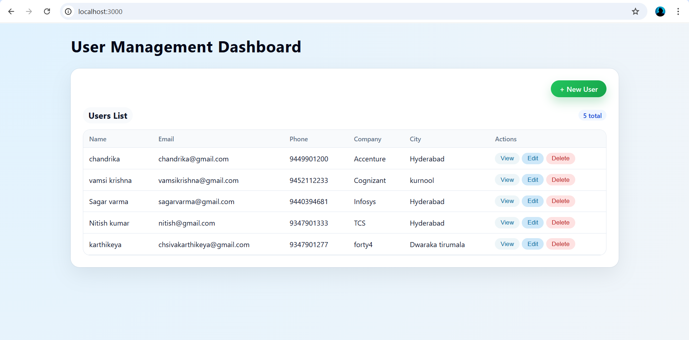
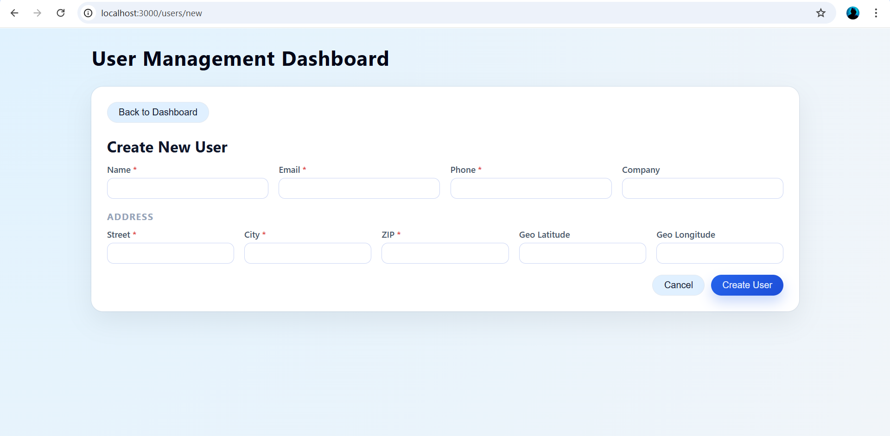
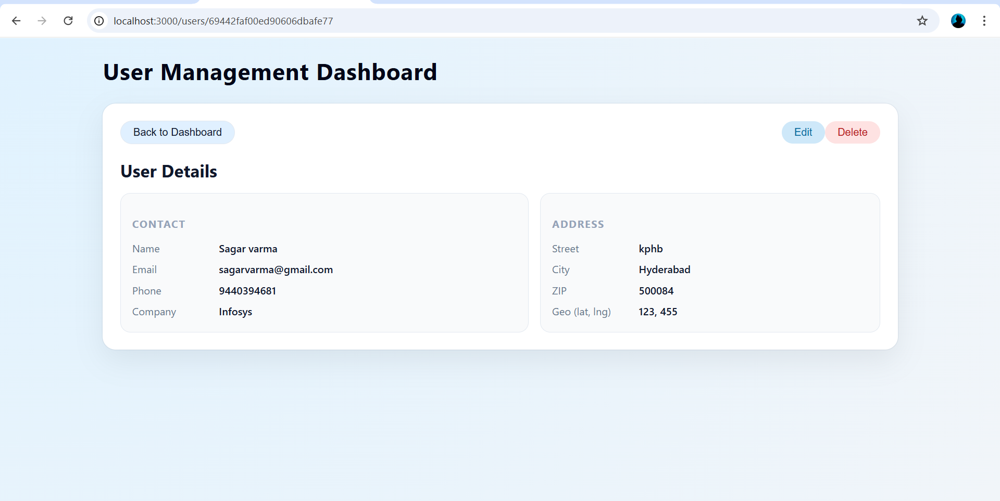
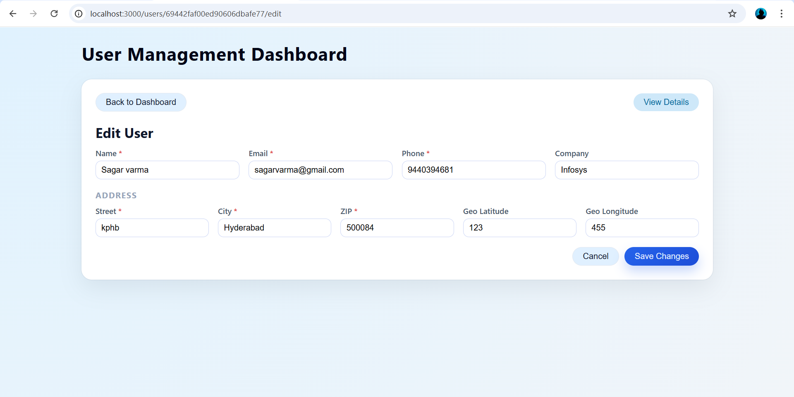

# User Management Dashboard

The User Management Dashboard is a full-stack web application that allows users to be added, viewed, edited, and deleted from a centralized dashboard. This project is built using React.js for the frontend, Node.js with Express.js for the backend, and MongoDB as the database.

---

## Features

### Frontend
- Dashboard to view all users
- Create new user form
- View user details page
- Edit and delete users
- Client-side form validation
- Responsive UI

### Backend
- RESTful APIs
- Create, read, update, and delete users
- Server-side validation
- Error handling for invalid data and missing users

---

## Tech Stack

### Frontend
- React.js (Functional Components & Hooks)
- React Router
- Axios

### Backend
- Node.js
- Express.js

### Database
- MongoDB with Mongoose

---

## Setup Instructions

### Backend Setup
- cd backend
- npm install
- npm start

### Frontend Setup
- cd frontend
- npm install
- npm start

## Screenshots

### Dashboard

### Add User

### User Details

### Edit User

